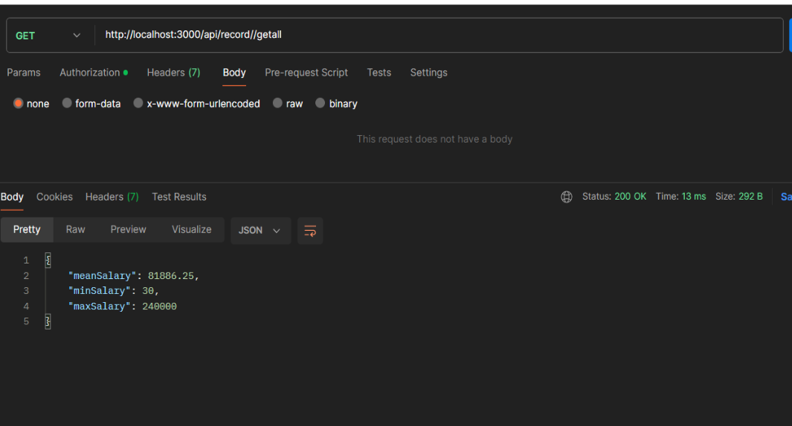

This API provides functionality to manage employee records and fetch summary statistics for salary data based on various criteria.

## Installation

To run this project locally, follow these steps:

1. Clone this repository to your local machine.
2. Navigate to the project directory.
3. Run `npm install` to install all dependencies.

# plead refer to the google docs ( https://docs.google.com/document/d/1nh7oWoAmrctRcRRxwhgm4smoe1S6a3mMdDkMrndJejo/edit?usp=sharing ) for the screenshots and better presentaion 

# 1. User Sign-up

Endpoint: POST /api/user/signup

    Payload:
    {
    "user": {
        "username": "<username>",
        "password": "<password>"
    }
    }
    Response:

    {
    "username": "akashsahu1",
    "token": "<jwt_token>"
    }

# Authorization
    To access protected endpoints, include the JWT token obtained during sign-up in the Authorization header of the request.
    Ensure that the username is provided in the payload of each request for verification purpose

# 2. Adding a New Record

Endpoint: POST /api/record/addnew

    Payload:
    {
    "username": "example_user",
    "record": {
        "name": "akash sahu",
        "salary": 5000,
        "currency": "USD",
        "department": "Banking",
        "sub_department": "Loan",
        "on_contract": true
    }
    }
    Response:

    {
    "message": "Employee added successfully."
    }

# 3. Deleting a Record

    Endpoint: POST /api/record/remove

    Payload:

    {
    "username": "example_user",
    "record": {
        "name": "Anupam"
    }
    }

# 4. Get Salary Statistics for All Records

    Endpoint: GET /api/record/getall

    Response:

    {
    "meanSalary": 20066009,
    "minSalary": 30,
    "maxSalary": 200000000
    }

# 5. Get Salary Statistics for All Records (with Currency Query)

    Endpoint: GET /api/record/getall/:currency

    

    Response:
    {
    "meanSalary": 70000,
    "minSalary": 70000,
    "maxSalary": 70000
    }

    
# 6. Get Salary Statistics for All Contract Records

    Endpoint: GET /api/record/getallcontract

    Response:

    {
    "meanSalary": 100000,
    "minSalary": 90000,
    "maxSalary": 110000
    }

#  7. Get Statistics for All Departments
    Endpoint: GET /api/record/getalldepartment

        Response:

        {
        "Engineering": {
            "meanSalary": 40099006,
            "minSalary": 30,
            "maxSalary": 200000000
        },
        "Banking": {
            "meanSalary": 47500,
            "minSalary": 5000,
            "maxSalary": 90000
        },
        "Operations": {
            "meanSalary": 35015,
            "minSalary": 30,
            "maxSalary": 70000
        },
        "Administration": {
            "meanSalary": 30,
            "minSalary": 30,
            "maxSalary": 30
        }
    }

# 8. Get Statistics for All Department-Subdepartment Combinations
    Endpoint: GET /api/record/getallsubdepartment

    Response:

    
    {
    "Engineering-Platform": {
        "meanSalary": 40099006,
        "minSalary": 30,
        "maxSalary": 200000000
    },
    "Banking-Loan": {
        "meanSalary": 90000,
        "minSalary": 90000,
        "maxSalary": 90000
    },
    "Operations-CustomerOnboarding": {
        "meanSalary": 35015,
        "minSalary": 30,
        "maxSalary": 70000
    },
    "Administration-Agriculture": {
        "meanSalary": 30,
        "minSalary": 30,
        "maxSalary": 30
    },
    "Banking-loan": {
        "meanSalary": 5000,
        "minSalary": 5000,
        "maxSalary": 5000
    }
}

# ________________________________________________________________________________________

# --------------------------------------------------------------------------------------

Akash Sahu  

akashsahu5020@gmail.com

https://www.linkedin.com/in/akashsahu5020

